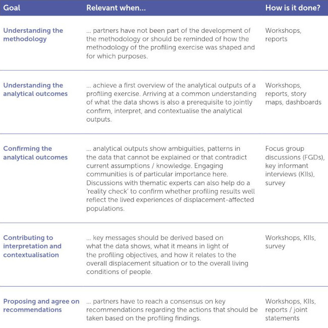
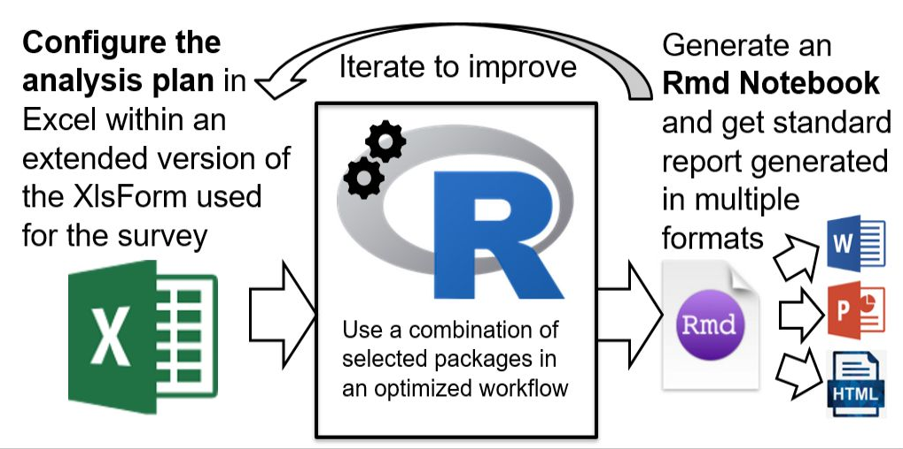

```{r setup, include=FALSE}
options(htmltools.dir.version = FALSE)
knitr::opts_chunk$set(
  warning = FALSE,
  message = FALSE,
  fig.showtext = TRUE
)
library(tidyverse)
library(unhcrthemes)
library(fontawesome)
```


## Survey Data, aka micro-data are key data source for a number of indicators

When implementing public programmes, some indicators can be sourced through existing monitoring systems, expert review or self assessment but a large part are __survey-based indicators__ that requires to collect information directly from the target population


A survey is ideally designed to collect information on a small subset of the total population, in order to, assuming this subset is a representative sample of the entire population, __extrapolate the findings__ of analysis

Based on a questionnaires, __standardized indicators are calculated__ with a view of comparing them to a baseline (for instance the same survey performed the year before, or the same indicators calculated for another population target).

---

## Survey Data, aka micro-data have secificities

[Clean and anonymized data](https://edouard-legoupil.github.io/HighFrequencyChecks/tutorial/index.html) need to go through a number of __technical manipulations__ before one can use them for interpretation:

 * Need to __relabel__ the original question wording to make them quickly legible when doing the interpretation

 * Need to __regroup__ and  __crosstabulate__  questions
 
 * create intermediary indicator __calculations__
 
 * use specific survey __weights__ to correctly express the representativeness of each records in the raw data in relation with the original sampling universe  
 
 * translate the data into __visual charts__ than be easily consumed (understood and interpreted) by subject matter experts 


---
 
##  How to approach survey data analysis

To summarize, an analyst will need to support different stages, each of them supported by specific deliverables: 

 1. __Initial data exploration__: this is the moment where you identify and apply all data manipulations explained before. As an output from this stage, the analyst should have a collection of relevant charts to bring to the attention of the subject matter expert.
 
 2. __Joint Data Interpretation__: Once the exploration is complete, the next step is to organize the charts into a presentation / slide deck. This can imply to add contextual information so that the information can be better interpretated. Additionally the charts should be grouped together around key research question in order to generated discussions around different point of views. All experts can jointly look at them in order to discuss the potential interpretation and agree on the main insights from the study
 
 3. __Dissemination / Data story telling__: in this last stage, the insights gathered in phase 2 are brought together into communication material. The goal is develop persuasive contents in order to use the data either for advocacy, for policy making and/or for programme design

---

## Initial Data Exploration

> Collect what you need and use what you collect! 

Though this stage, you need to process the data and develop visuals that can quality for intepretation. 
This data crunching report allows to quickly identify potential patterns. It produces a lot of visuals. Therefore it is key to carefully select the most relevant visual that will be presented for potential interpretation in the next step. 
 
In order to guide this selection phase, data experts, in collaboration with the data analysis group, can use the following elements:
 
  *  For numeric value, check the frequency distributions of each variable to average, deviation, including outlier and oddities
 
  *  For categorical variables, check for unexpected values: any weird results based on common sense expectations
 
  *  Use correlation analysis to check for potential contradictions in respondents answers to different questions for identified associations (chi-square)
 
  *  Always, Check for missing data (NA) or "%of respondent who answered" that you cannot confidently explain
 
  *  Check unanswered questions, that corresponds to unused skip logic in the questionnaire: For instance, did a person who was never displaced answer displacement-related questions? Were employment-related answers provided for a toddler?


---

## Joint data interpretation

.pull-left[

When analyzing those representations in a collective setting during data interpretation sessions, the group shall:  
 
  1.  __Reflect__: question data quality and/or make suggestions to adjust questions, identify additional cleaning steps;   

  2.  __Interpret__: develop qualitative interpretations of data patterns;     

  3.  __Recommend__: suggest recommendations in terms of programmatic adjustment;    

  4.  __Classify__: define level of sensitivity for certain topics if required;     


.bg-blue[

 A typical data interpretation session shall not last more than 2 hours and include more than 60 visuals to look at in order to keep participants with a good focus level.

]


]

.pull-right[


```{r, echo=FALSE, out.width = '80%'}
# 

```


]


---

## Dissemination / data story telling

Story telling is that last stage of the process. A good data story is a way to communicate valuable insights and assign meaning and context to data that otherwise lives as numbers in an Excel spreadsheet. 

.bg-blue[
The narrative shall have a hook, momentum, or a captivating purpose. Finding such narrative structure is therefore a prerequisite. 
]

Such stories can be categorized according to the four main narrative frames below, each of them being linked to programs design or implementation. The presented data shall reflect the operation context to reinforce what readers knows or to reveal what they don’t:  

 * shed light on a previously unexplored topic (it teaches people __something new__ or they have not heard before),  

 * introduce an interesting angle (gives them a __new perspective__)  

 * provide useful suggestions to solve a problem (__inspires to act__)  

 * disprove a hypothesis / __debunk a widely held belief__ in terms of programmatic assumption.  

???

Internal data are unique opportunities to build unique and original story ideas. In a world of regurgitated content, data storytelling can help UNHCR stand out above the noise. In a world full of conjecture, people want cold, hard numbers that anchor claims to reality. If you can anchor your story to credible data, readers will be more inclined to trust both the message and UNHCR as an institution. By revealing insights, the organization can demonstrate their in-depth knowledge of the subject and that rather than hiding them, there’s a much stronger benefit to share as it can lead conversations. 

Many stories are built from with an explorative approach, where viewers are encouraged to explore the data to draw their own conclusions and focus on the stories most relevant to them. The narrative approach where viewers are guided through a narrative to arrive at a specific conclusion is much more effective. Building narrative stories rather than only sharing the data for information, is also a way to generate the maximum value from the initial data collection investment. 


--- 


---

## So how can I do all of this???

Implementing all the step above is challenging :

 * Manually performing all the steps is extremely time intensive
 
 * Knowing the adequate tools to apply each step is an expertise by itself
 
 * Re-doing the analysis if one finds an mistake in any initial steps can be a nightmare


---

## Kobocruncher main concept: document all your analysis plan within an extended xlsform





???

History of the package: started from some script, then script turned into functions, then functions turned into a package, then package designed with notebook template

Results is first addressing my personnal need to quickly process survey data in a reproducible way

I am not a stastician nor a programmer, all the code is fairly simple and quite documented so that anyone can look at it... 


---

## You do not need to be an expert as soon as you follow recipes. 

KoboCruncher is an R package designed to take care of the processing component in a .large[__Reproducibile way__] so that the technical team can focus on the interpretation.


 * all analysis input are de facto .large[__fully documented__],  
 
 * .large[__Good practices & standards__] are enforced through the package
 
 * Once the configuration file is written, getting quickly reports with Rstudio allows for .large[__increased productivity__]
 
 * Indeed only a limited knowledge of R is required as most of the work is done in excel, which results  .large[__minimum training__] 
 
 * .large[__Working through iterations__] where you check the output and adjust as many time as needed the settings is a natural approach
 


---
class: inverse center middle

# Workshop Overview

###  The sessions are organised to guide you through the different steps through a full day of training:

In the morning, explaining the main concepts

Afternoon with data cleaning, indicator calculations and basic anonymisation

---

## Morning sessions: 

  *  [01-First_Report](01-First_Report.html) will show how to get the first iteration of your data exploration report
  *  [02-Relabeling](02-Relabeling.html) the way your survey variables are labelled for data collection is not always optimal when the goal is display the resulting information, hence you need to relabel (mostly shorten and simplify) the survey content
  *  [03-Grouping_Questions](03-Grouping_Questions.html) Within a questionnaire, questions follows a certain sequence in order to facilitate the interview. When exploring the results, it is often required to regroup the questions in a different way and inline with key research questions
  *  [04-Setting_Crosstabulation](04-Setting_Crosstabulation.html) an essential step during data exploration is compare the survey results between different respondent segments
  *  [05-Searching_Asssociation](05-Searching_Asssociation.html) beyond the cross-tabulation, it is key to check how variables relate to each other. This can be done with statistical test that verify if variables are significantly associated

  
---

## Afternoon session: 

  *  [06-Indicator_calculation](06-Indicator_calculation.html) after reviewing the first iteration of the reports, we can create calculated variable and indicator 

  *  [07-Weighting](07-Weighting.html) If the data was created through a probabilistic selection sampling approach, then we can apply weighting to the data before and regenerate the report so that those weights are reflected

  *  [08-Interpreting](08-Interpreting.html) Once data are ready, time comes to facilitate  the interpretation of the data  


???

initial 

https://tidy-survey-r.github.io/tidy-survey-short-course/

---
class: inverse, center, middle

# Thank you

Do not hesitate to raise your questions in the [ticket system](https://github.com/Edouard-Legoupil/kobocruncher/issues/new) so the training content can be improved accordingly!

__Next session__: 

 [01-First_Report will show how to get the first iteration of your data exploration report](01-First_Report.html) 
