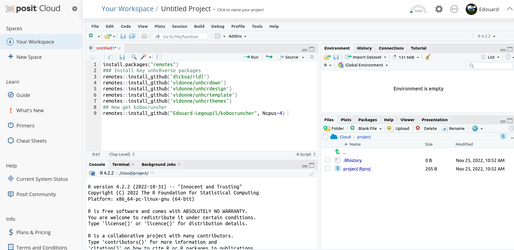
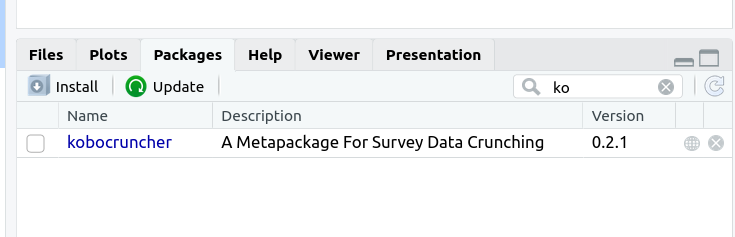
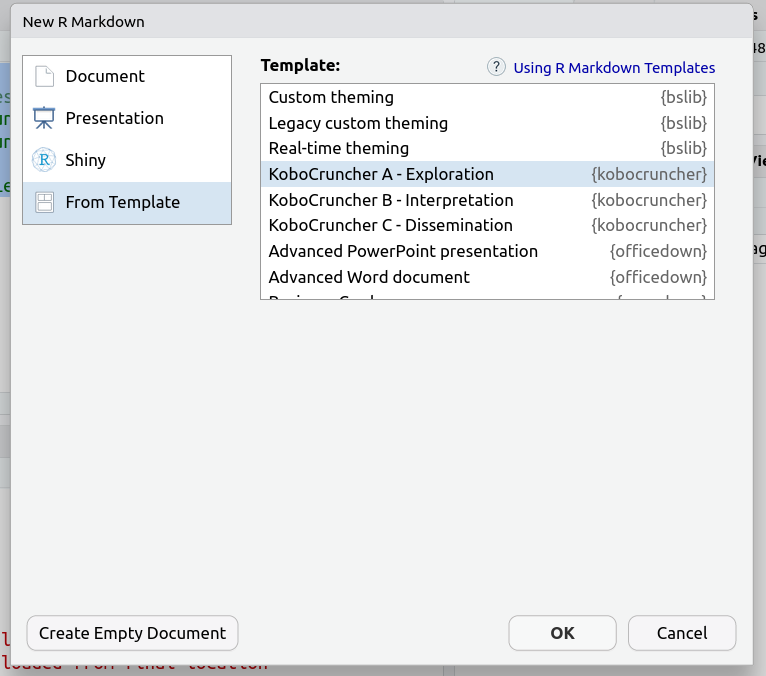
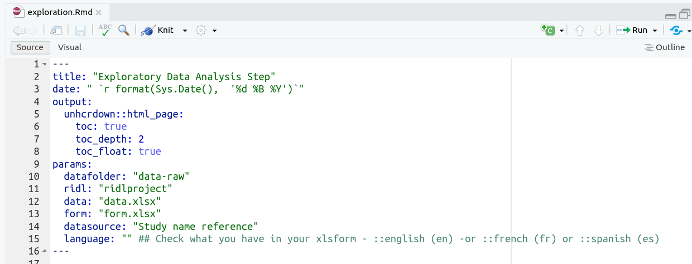
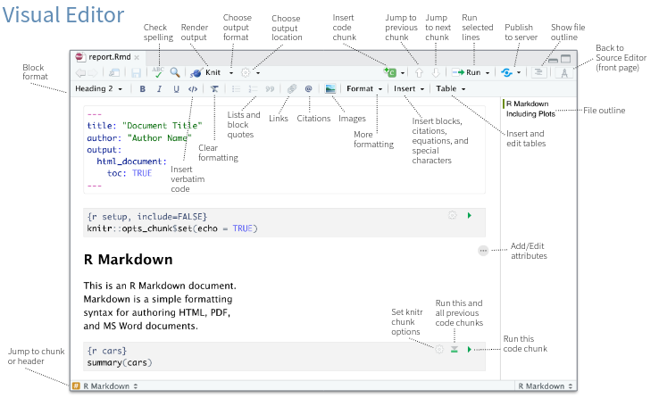

```{r setup, include=FALSE}
options(htmltools.dir.version = FALSE)
knitr::opts_chunk$set(
  warning = FALSE,
  message = FALSE,
  fig.showtext = TRUE
)
library(tidyverse)
library(unhcrthemes)
library(fontawesome)
```


## Setting up the environment

2 options:

 - Rstudio Cloud for training and testing
 
 - install your own Rstudio on your computer
 
 
Recall that all slides and code for this training are available on GitHub: https://github.com/tidy-survey-r/tidy-survey-short-course 

---

## Option 1: RStudio Cloud

Good option if you are a __first time user__ and in oder to get a first introduction! 

- Sign-up for a free RStudio Cloud account (https://rstudio.cloud/)

- Access the project and files via link in email and Zoom chat

- Click "START" to open the project and get started

- RStudio Cloud has the same features and appearance as RStudio for ease of use


???
Github repo is for future reference, all material on RStudio cloud

---

## Option 2: Use your own RStudio environment

For data Protection reason, needs to be done as soon as you are working with production data

.pull-left[

Install Software

  1. [Install R](https://cran.r-project.org/): follow instruction from the installer.

  2. __Only for windows user__ [Install RTools](https://cran.r-project.org/bin/windows/Rtools): This executable is needed to install the package from github. Follow instruction from the installer.

  3. [Install R Studio](https://www.rstudio.com/products/rstudio/download/#download) : follow instruction from the installer

You can now Launch __R Studio__ and open a new project. 

You may check the list of common issues in the [Common Troubleshooting](articles/Troubleshooting.html) article.
]

.pull-right[

Create project

  *  In R Studio, select File, click New project. A box opens
  
  *  Choose New Directory
  
  *  Choose Empty project
  
  *  Type the name of the folder where you want to put your data
  
  *  Select where you want to put this folder
  
  *  Click Create project
]


---

## Rstudio Interface


---

## Package installation from Github

Create an R script and paste the following command: 

```{r eval=FALSE, include=TRUE, message=FALSE}

# Run package installation if you don't have these packages already
# As a reminder, installing takes package from internet to your computer 
# and only needs to be done once, not each session

install.packages("remotes")
### Install Key unhcRverse packages in order to get the corporate style & brand
remotes::install_github('vidonne/unhcrdown')
remotes::install_github('vidonne/unhcrthemes')
## Now get kobocruncher
remotes::install_github("Edouard-Legoupil/kobocruncher", Ncpus=4) 
``` 

---

## Screenshot from Rstudio cloud





---

## Check the package is installed after you run the package installation command 


.pull-left[
.
See the package tab in the right-down panel

You can search for the package name `kobocruncher`

You can click on the blue link to access the documentation

]

.pull-right[


]

---

## R Markdown combines __R code with text__ 


 1. Knit to different __output format__: PDF, DOCX, HTML, PPTX, and more

 2. Don't copy/paste output to your manuscript/report. __Make your manuscript/report with R Markdown__

 3. __Automatic styling__ table, figure numbering, colors, font, etc.. 

 4. Can create __parameterized reports__. Example: run an analysis for each state and each state gets a report

For beginners: https://rmarkdown.rstudio.com/lesson-1.html

???

Each time document is Knitted, a self-contained session is started.  Prevents problems with depending on something in your environment that aren't explicitly called out

---

## Now Let's create your first report


.pull-left[

To start with, let's use the first template "KoboCruncher A - Exploration"

To do so:

> file > New file > R markdown > From Template

]

.pull-right[


]


---

## Save you notebook and check the report __parameters__

.pull-left[

In an RMD report, the top part of the file, the header is called [YAML]().

A YAML header contains YAML arguments, such as “title”, “author”, and “output”, demarcated by three dashes (—) on either end.

 

]

.pull-right[

The YAML header for this template contains also a few parameters that we will now

```
params:
  datafolder: "data-raw" ## This is the default folder where to put you data in
  ridl: "ridlproject" ## Name of the ridl project where you data is documented and archived
  data: "data.xlsx" ## Name of the data file
  form: "form.xlsx" ## name of the xlsform - 
  datasource: "Study name reference" ## String used in caption for all your charts
  publish: "no" ## put to "yes" in order to add your report, source and analysis plan as ressource within the same ridl c
  republish: "no"
  visibility: "public"
  stage: "exploration_initial" ## you may change this to exploration_advanced if you configuring many 
  language: "" ## Check what you have in your xlsform - ::english (en) -or ::french (fr) or ::spanish (es)
```


]


---


---

## Editing a notebook is simple!





---
class: inverse, center, middle

# TIME TO PRACTISE ON YOUR OWN 

5 minutes! 

 - Get your environment ready
 - Open a notebook
 - Compile it with demo dataset
 
 

---
class: inverse, center, middle

# Thank you

__Next session__: [02-Relabeling](02-Relabeling.html) the way your survey variables are labelled for data collection is not always optimal when the goal is display the resulting information, hence you need to relabel (mostly shorten and simplify) the survey content
