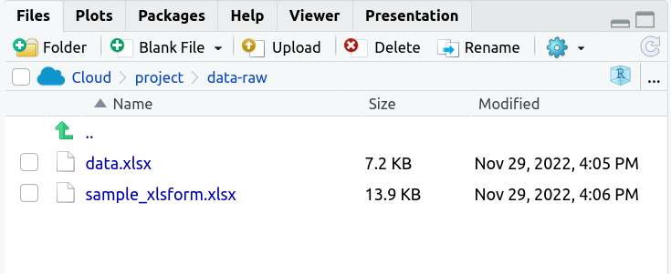
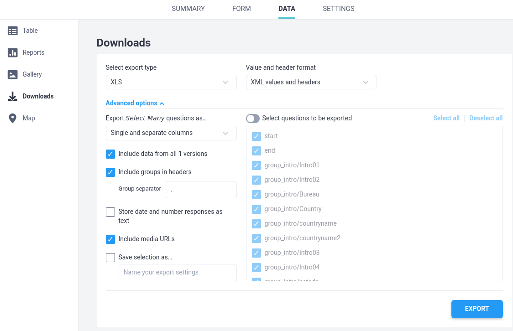
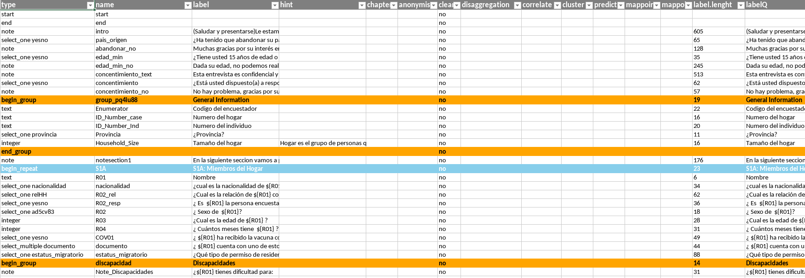

```{r setup, include=FALSE}
options(htmltools.dir.version = FALSE)
knitr::opts_chunk$set(
  warning = FALSE,
  message = FALSE,
  fig.showtext = TRUE
)
library(tidyverse)
library(unhcrthemes)
library(fontawesome)
```

## Why do you need to relabel your dataset

When you obtain the raw data from RIDL or from the kobo server, the questions labels you get are the one used during data collection.

The way questions are phrased during the interview might not always be optimal for the data analysis stage.

In order to have __legible and effective chart ouput__, it's key to relabel some of the questions.


---

## What is a good question and response label for data analysis?

Labels should be .large[__short__] and .large[__concise__] in order to ease quick reading (_i.e. to capture the content of the final chart in a few seconds_).


Ideally try to summarize the initial wording:

 * Less than 80 characters for variable labels
 
 * Less than 40 characters for responses - so that resulting charts will not be overloaded.
 


---

## Other issues to fix when relabeling


In case of .large[__skip logic questions__], the original label will not be self-explanatory as it refers to a previous questions. In such, you need to rephrase explicitly the condition in the variable label. Based on the initial version of the exploration report, check carefully the __response rate in the chart caption__ for each question to identify the one where the label sould explicity mention the question relevance.
 
 
Reword the label so that they appear .large[__as simple statement__] rather then in an interrogative form, for instance
 
  * "_For how long have you been living here?_"
  * can be rephrased as "Residency Duration"
  
In case the question included .large[__calculated reference__], for instance `${HH02}` (aka a call to a previous question answer), replace this part  

Potentially search and replace .large[__special characters__]

---

## Let's start working with your own data

.pull-left[

The report parameters

 *   `datafolder`: "data-raw" You can create a new folder within your project. Default value for this parameter is  `data-raw`

 *   `data`: "data.xlsx"  Name of the data file that you exported from [kobotoolbox](http://kobo.unhcr.org) or from [RIDL](http://ridl.unhcr.org). The demo data set is [here](https://github.com/Edouard-Legoupil/kobocruncher/blob/main/inst/data.xlsx)

 *   `form`: "sample_form.xlsx" 
 Name of the xlsform file that you exported from [kobotoolbox](http://kobo.unhcr.org) or from [RIDL](http://ridl.unhcr.org). The demo form set is [here](https://github.com/Edouard-Legoupil/kobocruncher/blob/main/inst/sample_xlsform.xlsx)


]

.pull-right[




]


---

## A note on the required format for the data


.pull-left[
.bg-blue[
Your data and form files need to be an `.xlsx` file! Not an `.xls` file  
] 


Your data need to have: 
 * `XML values and headers` --> this is required in order to re-adjust the labels
 
 * Include groups in headers --> this is required to build correctly the data dictionnary


]

.pull-right[




]

 
---

## Language

You can prepare your  crunching in different languages. This is set up by a specific YAML parameter.
 *   `language`: "" 
 
 Set up the language you will use for the analysis in case your questionnaire was multilingual.
 
Check what you __PRECISELY__ have in your specific `xlsform` - for instance, if you have and want to select :

 * `label::english (en)` then set up the parameter as `language: "english (en)"`  
 
 * `label::spanish (es)`then set up the parameter as `language: "spanish (es)"` -- ake sure not add the double comma

 * `label::French (fr)` then set up the parameter as `language: "French (fr)"` -- note that it is case sensitive

  * `label::Español (es)`then set up the parameter as `language: "Español (es)"` -- make sure to use UTF8 encoding when you have special character. 
  
In this last case, note that this would not be a correct questionnaire encoding practice as language description should be aligned with [standard language description from  Internet Assigned Numbers Authority (IANA)](http://www.iana.org/assignments/language-subtag-registry/language-subtag-registry) which are precisely designed to avoid special characters management. Language name first letter should also be capitalised.
 
 
 
---

## Now you can expand your xlsform!

A dedicated function will process the original `xlsform` and add all the required column to configure your analysis plan

```{r analysis_plan, eval=FALSE, include=TRUE}
## Let's extract the analysis plan from the xlsform - or extend the current one
kobo_prepare_form(xlsformpath = xlsformpath ,
                 xlsformpathout =  here::here(params$datafolder, params$form)  ,
                 label_language = params$language ) 
```

Once you run the function, you can re-open your xlsform and review it

---




---

## What happenned?

A few additional column were inserted in your `xlsform` in order to set up the __analysis plan__

Some default formatting were created so that you can quickly identify the initial question groups and repeated questions


---

## Adjust the labels as required in this new version of the xlsform

To adjust the label in the column `label`, you can filter long questions based on the `label.lenght` 

You can also always refer to the original label wording in the file `labelQ`

You could potentially translate the whole content in a new language and insert it in the `label`

In the column `hint`, you will find the orginal hint. You can also re-adjust them to provide __interpretation hint__. Those hints will be displayed per default within each chart `subtile`


---

## Ordinal variables

By default, categorical charts will be generated and order by frequencies...

BUT some variables are ordinal... for instance likert questions:

 * Very safe  
 
 * Fairly safe 
 
 * Bit unsafe 
 
 * Very unsafe

In order to get those variables correctly represented, fill in the `order` column within the `choices` worksheet of the expanded `xlsform`

---

## And now you can regenerate the report

Make sure you have the new version of the form in the correct folder

Then knit the report et voila


---
class: inverse, center, middle

# TIME TO PRACTISE ON YOUR OWN! 

### .large[.white[`r fontawesome::fa("fas fa-pen-nib"  )  `] **10 minutes! **] 

 
```{r echo=FALSE}
countdown::countdown(minutes = 10,
                     seconds = 0,
                     margin = "5%",
                     font_size = "8em",
                     style = "position: relative; width: min-content;",
                     # Fanfare when it's over
                     play_sound = TRUE)
```

 Expand the xlsfom, Open it with Excel and adjust the wording of the questions, then save/upload the revised file and knit again your report
 
 
Do not hesitate to raise your questions in the [ticket system](https://github.com/Edouard-Legoupil/kobocruncher/issues/new) or in the chat so the training content can be improved accordingly! 
 
---
class: inverse, center, middle


### .large[.white[`r fontawesome::fa("fas fa-clock"  )  `] **Let's take a break! **] 
 
```{r echo=FALSE}
countdown::countdown(minutes = 10,
                     seconds = 0,
                     margin = "5%",
                     font_size = "8em",
                     style = "position: relative; width: min-content;",
                     # Fanfare when it's over
                     play_sound = TRUE)
```

__Next session__: 

[03-Grouping_Questions Within a questionnaire, questions follows a certain sequence in order to facilitate the interview. When exploring the results, it is often required to regroup the questions in a different way and inline with key research questions](03-Grouping_Questions.html)
