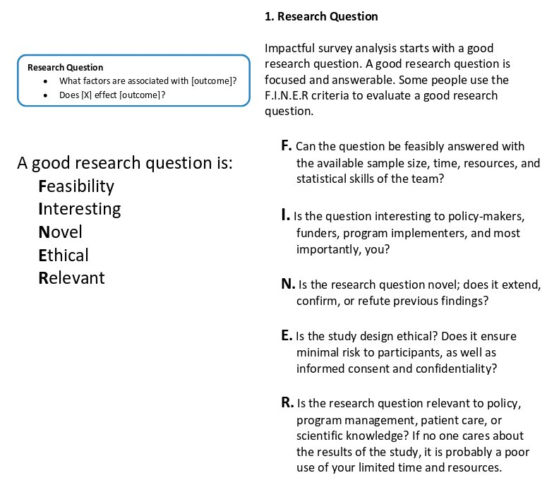
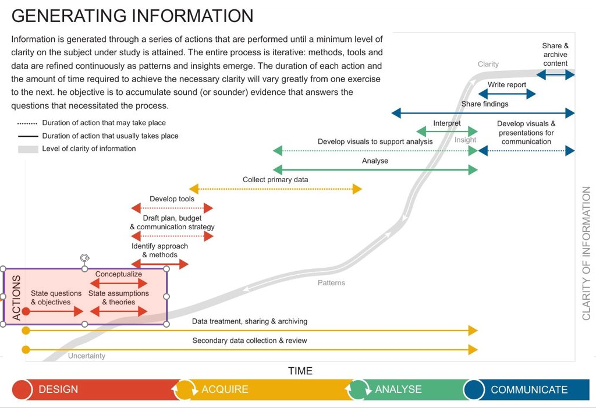

```{r setup, include=FALSE}
options(htmltools.dir.version = FALSE)
knitr::opts_chunk$set(
  warning = FALSE,
  message = FALSE,
  fig.showtext = TRUE
)
library(tidyverse)
library(unhcrthemes)
library(fontawesome)
```

## Why do you need to regroup questions?

The way questions are grouped in your form are linked to an .large[__efficient question sequence__]

The order of questions in a survey  have a real [effect on how respondents answer](https://www.qualtrics.com/experience-management/research/question-sequence-flow-style/).  

At the data analysis stage, this order might no make sense anymore. 

---

## Setting up your Key Research Questions

.pull-left[
 
 Behind each survey are at least one and often multiple .large[__broader questions__]. 
 
 
 .bg-blue[
 Those higher level questions are the best way to group together the different part of the survey content as they will naturally help to uncover insights
] 


]

.pull-right[




]
???

http://www.populationsurveyanalysis.com/wp-content/uploads/2014/09/workflow_handout.pdf

---

## How to write a good research question?

A limited number of research question makes it easier to cover the topics in depth  and provide clearer direction to map and source relevant data. The question should be:

 * .large[__Clear__]:   provides enough specifics that one’s audience can easily understand its purpose without needing additional explanation.	

 * .large[__Focused__]: is narrow enough that it can be answered thoroughly but not too narrow so that I remains a proper open-ended questions.	

 * .large[__Concise__]: is expressed in the fewest possible words.	

 * .large[__Complex__]: is not answerable with a simple “yes” or “no,” but rather requires synthesis and analysis of ideas and sources prior to composition of an answer.

 * .large[__Arguable__]: its potential answers are open to debate rather than accepted facts.

 * .large[__Relevant__]: is linked to humanitarian actions whether in terms of advocacy or program design

---



???

https://shop.icrc.org/acquiring-and-analysing-data-in-support-of-evidence-based-decisions-a-guide-for-humanitarian-work-pdf-en 

---

## How can I regroup questions within my survey?


By default the initial exploration report follows the survey question sequence but this can be adjusted:


 1. Open the expanded xlsform 
 
 2. fill in the `chapter` and `subchapter` column
 
 
 .bg-blue[
If you leave `subchapter` empty they will not be used
]   


---
class: inverse, center, middle

# TIME TO PRACTISE ON YOUR OWN! 

###  .large[.white[`r fontawesome::fa("fas fa-pen-nib"  )  `] **5 minutes! **] 

```{r echo=FALSE}
countdown::countdown(minutes = 5,
                     seconds = 0,
                     margin = "5%",
                     font_size = "8em",
                     style = "position: relative; width: min-content;",
                     # Fanfare when it's over
                     play_sound = TRUE)
```

 Download again locally and fill in the chapter and sub-chapter column, save the file and knit again your report


Do not hesitate to raise your questions in the [ticket system](https://github.com/Edouard-Legoupil/kobocruncher/issues/new) or in the chat so the training content can be improved accordingly! 
 
---
class: inverse, center, middle


### .large[.white[`r fontawesome::fa("fas fa-clock"  )  `] **Let's take a break! **] 
 
```{r echo=FALSE}
countdown::countdown(minutes = 10,
                     seconds = 0,
                     margin = "5%",
                     font_size = "8em",
                     style = "position: relative; width: min-content;",
                     # Fanfare when it's over
                     play_sound = TRUE)
```


__Next session__: 

[04-Setting_Crosstabulation an essential step during data exploration is compare the survey results between different respondent segments](04-Setting_Crosstabulation.html)
