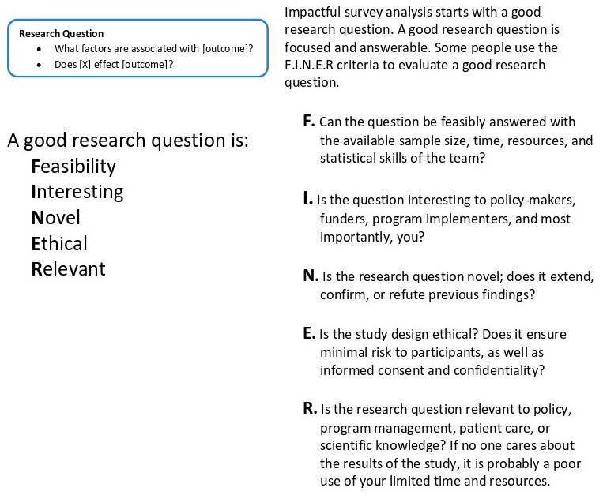

```{r setup, include=FALSE}
options(htmltools.dir.version = FALSE)
knitr::opts_chunk$set(
  warning = FALSE,
  message = FALSE,
  fig.showtext = TRUE
)
library(tidyverse)
library(unhcrthemes)
library(fontawesome)
```

## Why do you need to regroup questions?


## Setting up your Key Research Questions



???

http://www.populationsurveyanalysis.com/wp-content/uploads/2014/09/workflow_handout.pdf


---
class: inverse, center, middle

# TIME TO PRACTISE ON YOUR OWN 

5 minutes! 

 - Download again locally and fill in the chapter and sub-chapter column
 
 - upload and knit again your report


---
class: inverse, center, middle

# Thank you

__Next session__:  [04-Setting_Crosstabulation](04-Setting_Crosstabulation.html) an essential step during data exploration is compare the survey results between different respondent segments
