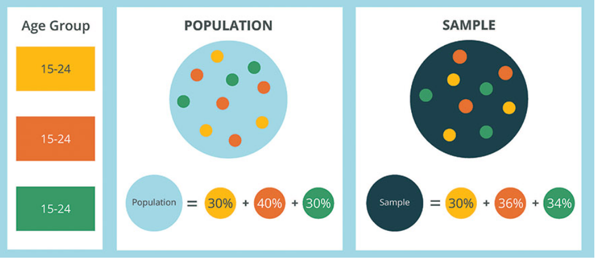
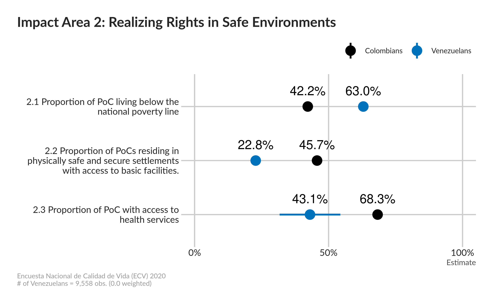

```{r setup, include=FALSE}
options(htmltools.dir.version = FALSE)
knitr::opts_chunk$set(
  warning = FALSE,
  message = FALSE,
  fig.showtext = TRUE
)
library(tidyverse)
library(unhcrthemes)
library(fontawesome)
```


## Weighting: reducing selection bias!

In the absence of  survey data weighting, there's a risk over or under-represent certain demographic segments compared to their true level in the whole population.

The use of weights in survey analysis compensates for this differential representation, thus producing estimates that relate to the target population.

Weights vary due to differential sampling rates because of oversampling and because response and coverage rates vary across sub populations (specifically hard-to-reach demographic groups).

The term weighting refers to the .large[__different amounts of load or emphasis__] we give to each individual survey response. Responses from a type of person who is very rare will get greater emphasis in the final results. In contrast, respondents who represent common types of people will be de-emphasized. 

Weighting are also important for the anonymization process too (see [next session](08-Anonymising.html)!)

---


## Original sampling designs - the design weights


.pull-left[

When devising the orginal sampling strategy, an initial decision is made in term of design, each of them coming with weight calculation, between: 


 *  __Simple random sampling__: every unit has the same chance of being selected -- _Without replacement_: units can only be selected once -- or _With replacement_: units can be selected more than once

 *  __Systematic sampling__: sample n individuals from a ordered list and sampling individuals at an interval with a random starting point

 *  __Probability proportional to size__: probability of selection is proportional to "size"

 *  __Stratified sampling__: divide population into mutually exclusive subgroups (strata). Randomly sample within each stratum

 *  __Clustered sampling__: divide population into mutually exclusive subgroups (clusters). Randomly sample clusters and then individuals within clusters
]

.pull-right[

Look at documentation associated with the analysis file to find out about the weight! 

Keywords to look for: methodology, design, analysis guide, technical documentation

Documentation will indicate the variables needed to specify the design. Look for weight and:

 *  strata and/or clusters/Primary Sampling Uunits. Sometimes pseudo-strata and pseudo-cluster  with FPC (finite population correction) 
 
 *  replicate weights (in case they got calibrated afterwards...)

]

---

## Post stratification / raking - the calibration weights

.pull-left[
Often, the original sampling strategy and plan is not respected.... 

 * People that were initially targeted do not reply and do not want to answer
 
 * High non-response from certain groups
 
 * In case of telephone interviews, people change their phone and the data were not updated... 
 

 .bg-blue[
In those situation,the original weights that were calculated when drawing the original sample needs to be recalculated for the analysis accounting for common demographic variables (_for instance:  age, gender, location, and education_), but also other variables (_such as internet usage or mobile versus land-line phone users_) when available...
]

]

.pull-right[

After weighting, when the population is compared to the weighted sample, the proportion of respondent from each age group should match



In order to reduce the potential risk of data weighting, it’s recommended to weight by as few variables as possible.  

]


???

 As the number of weighting variables goes up, the greater the risk that the weighting of one variable will confuse or interact with the weighting of another variable. Also, when data must be weighted, try to minimize the sizes of the weights. A general rule of thumb is never to weight a respondent less than .5 (a 50% weighting) nor more than 2.0 (a 200% weighting).
 
 
 https://www.pewresearch.org/methods/2018/01/26/how-different-weighting-methods-work/ 
 

---

## Weighting to be used may also depends on the final indicator to be calculated

.pull-left[

Also different weighting can be applied depending on the unit of analysis:

 * Household 
 
 * Individual

]

.pull-right[


 
 .bg-blue[
Post-stratification and the development of different weighting is complex. 

.large[Reach out to UNHCR Global Data Service and your regional DIMA to get support]

]    
]


---

##  How to set it up in Kobocruncher for common weighting approach?

By default, there's no weight. Add the weight depending on the level by adding a `weight_main` worksheet in your `xlsform`. The function `kobo_weight` will automatically look for the spreadsheet based on the name an based on the structure (prefix of the first variable name) will identify whether a cluster and stratification weighting should be applied. If you want to add specific weight for individuals (aka a nested table for instance called `members`), add another spreadsheet named accordingly (in the example above: `weighting_members`) 

.pull-left[
#### Setting up cluster weights

The structure of your worksheet should include precisely the following variables: 

 * `ids_XXX` : where XXX is precisely the name of the variable to use to identify the cluster in your dataset   

 * `weights`  : here's where you add the numeric values for the different weights

 * `fpc`  : stands for Finite Population Correction is a numerical estimation of the population sizes within the specific cluster 

]

.pull-right[

#### Setting up stratification weights

The structure of your worksheet should include precisely the following variables: 

 * `strata_XXX` : where XXX is precisely the name of the variable to use to identify the strata in your dataset 

 * `weights`  : here's where you add the numeric values for the different weights
]


???

In case of more complex design such as two-stage cluster sample or stratified, cluster design, request for support
Full presentation and course on [Tidy Survey Analysis with R](https://tidy-survey-r.github.io/tidy-survey-short-course/) 

data_srs %>% as_survey_design(fpc = fpc)# simple random sample (SRS)

data_strat %>% as_survey_design(strata = stype, weights = pw)# stratified sample

data_clus1 %>% as_survey_design(ids = dnum, weights = pw, fpc = fpc)# one-stage cluster sample

data_clus2 %>% as_survey_design(ids = c(dnum, snum), fpc = c(fpc1, fpc2))# two-stage cluster sample, weights computed from pop size

data_strat %>% as_survey_design(ids = dnum, strata = stype, weights =pw, nest = TRUE)# stratified, cluster design


---

## What will you get? A representation of uncertainity!


.pull-left[

Once you set up your weights, all your charts will be represented by defaults with error bars (also called whisker)

Error bars give a .large[__general idea of how precise a measurement is__], or conversely, how far from the reported value the true (error free) value might be.


]

.pull-right[

 Observe the error bar for the Proportion of PoC with Acces to health services


 

]


---
class: inverse, center, middle

# TIME TO PRACTISE ON YOUR OWN! 

### .large[.white[`r fontawesome::fa("fas fa-pen-nib"  )  `] **5 minutes! **] 

 
```{r echo=FALSE}
countdown::countdown(minutes = 5,
                     seconds = 0,
                     margin = "5%",
                     font_size = "8em",
                     style = "position: relative; width: min-content;",
                     # Fanfare when it's over
                     play_sound = TRUE)
```

 - Open again locally and fill in the weight tab in the xlsform
 
 - Regenerate the report and check the results
 

Do not hesitate to raise your questions in the [ticket system](https://github.com/Edouard-Legoupil/kobocruncher/issues/new) or in the chat so the training content can be improved accordingly! 
 
---
class: inverse, center, middle


### .large[.white[`r fontawesome::fa("fas fa-clock"  )  `] **Let's take a break! **] 
 
```{r echo=FALSE}
countdown::countdown(minutes = 10,
                     seconds = 0,
                     margin = "5%",
                     font_size = "8em",
                     style = "position: relative; width: min-content;",
                     # Fanfare when it's over
                     play_sound = TRUE)
```


__Next session__:   


[08-Anonymising In order to provide other people to work with the data, a first level of data anonymisation should be implemented](08-Anonymising.html)

