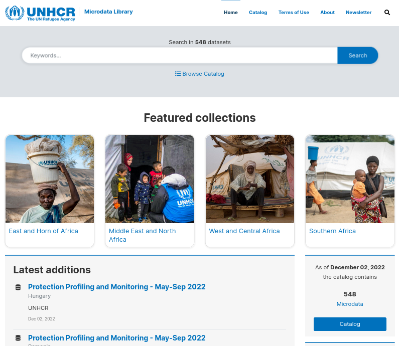

```{r setup, include=FALSE}
options(htmltools.dir.version = FALSE)
knitr::opts_chunk$set(
  warning = FALSE,
  message = FALSE,
  fig.showtext = TRUE
)
library(tidyverse)
library(unhcrthemes)
library(fontawesome)
```


 
# Dissemination of microdata (i.e. raw survey data) is crucial 

 * Reducing duplication in data collection; 
 
 * Improving the reliability and relevance of data; 
 
 * Supporting research and promoting development of new tools for using data; 
 
 * Enhancing the credibility of UNHCR as an authoritative source of Information on refugees. 
 

---

##  But requires first proper anonymisation


Suppose a hypothetical intruder has access to some released microdata and attempts to identify or find out more information about a particular respondent. Disclosure, also known as re-identification, occurs when the intruder reveals previously unknown information about a respondent by using the released data.

Three types of disclosure can be distinguished:  

 * __Identity disclosure__ occurs if the intruder associates a known individual with a released data record. For example, the intruder links a released data record with external information, or identifies a respondent with extreme data values. In this case, an intruder can exploit a small subset of variables to make the linkage, and once the linkage is successful, the intruder has access to all other information in the released data related to the specific respondent.
 
 * __Attribute disclosure__ occurs if the intruder is able to determine some new characteristics of an individual based on the information available in the released data. For example, if a hospital publishes data showing that all female patients aged 56 to 60 have cancer, an intruder then knows the medical condition of any female patient aged 56 to 60 without having to identify the specific individual. 
 
 * __Inferential disclosure__ occurs if the intruder is able to determine the value of some characteristic of an individual more accurately with the released data than otherwise would have been possible. For example, with a highly predictive regression model, an intruder may be able to infer a respondent's sensitive income information using attributes recorded in the data, leading to inferential disclosure.

???

>  Even when personal data is not being collected it still may be appropriate to apply the methodology since quasi-identifiable data  or other sensitive data could lead to personal identification or should not be shared.
https://jangorecki.github.io/blog/2014-11-07/Data-Anonymization-in-R.html
 

This is based on the World Bank sponsored [disclosure Control Toolbox](http://www.ihsn.org/software/disclosure-control-toolbox) for the R language and built on the recommendations from the [International Household Survey Network](http://ihsn.org/sites/default/files/resources/ihsn-working-paper-007-Oct27.pdf).
 
Per default, it is assumed that __direct identifiers__ (such as name, progres ID, telephone, GPS locations) values are removed.
 
---

## The paradox of Disclosure risks and information loss

.pull-left[

Data anonymisation is always a trade-off between disclosure risks and information loss. 

The objective is to modify data in such a way that both the disclosure risk and the information loss caused are acceptably low. 

There's no standards based on risk measurement as the risk measurement is linked to both the level of conservatism in the number of selected variables that are considered to be "at risk" and on the trust in the data analyst..
]
.pull-right[

```{r echo=FALSE}

### Tentative summary chart to explain the paradox
# library("xkcd")
# #vignette("xkcd-intro")
# #download.file("http://simonsoftware.se/other/xkcd.ttf", dest = "xkcd.ttf", mode = "wb")
# #font_import(paths = getwd(), pattern = "[X/x]kcd", prompt = FALSE)
# volunteers <- data.frame(year=c(2007:2011), 
#                          number=c(56470, 56998, 59686, 61783, 64251))
# 
# xrange <- range(volunteers$year)
# yrange <- range(volunteers$number)
# 
# ratioxy <-  diff(xrange) / diff(yrange)
# 
# datalines <- data.frame(xbegin=c(2008.3,2010.5),
#                         ybegin=c(63000,59600), 
#                         xend=c(2008.5,2010.3),
#                         yend=c(63400,59000))
# 
# mapping <- aes(x,
#                y,
#                scale,
#                ratioxy, 
#                angleofspine,
#                anglerighthumerus,
#                anglelefthumerus,
#                anglerightradius, 
#                angleleftradius,
#                anglerightleg, 
#                angleleftleg, 
#                angleofneck)
# 
# dataman <- data.frame( x= c(2008,2010),
#                        y=c(63000, 58850),
#                       scale = 1000 ,
#                       ratioxy = ratioxy,
#                       angleofspine =  -pi/2  ,
#                       anglerighthumerus = c(-pi/6, -pi/6),
#                       anglelefthumerus = c(-pi/2 - pi/6, -pi/2 - pi/6),
#                       anglerightradius = c(pi/5, -pi/5),
#                       angleleftradius = c(pi/5, -pi/5),
#                       angleleftleg = 3*pi/2  + pi / 12 ,
#                       anglerightleg = 3*pi/2  - pi / 12,
#                       angleofneck = runif(1, 3*pi/2-pi/10, 3*pi/2+pi/10))
#  
# datascaled <- data.frame(x=c(-3,3),y=c(-30,30))
# p <- ggplot(data=datascaled, aes(x=x,y=y)) + geom_point()
# xrange <- range(datascaled$x)
# yrange <- range(datascaled$y)
# ratioxy <- diff(xrange) / diff(yrange)
#  
# mapping <- aes(x=x,
#                y=y,
#                scale=scale,
#                ratioxy=ratioxy,
#                angleofspine = angleofspine,
#                anglerighthumerus = anglerighthumerus,
#                anglelefthumerus = anglelefthumerus,
#                anglerightradius = anglerightradius,
#                angleleftradius = angleleftradius,
#                anglerightleg =  anglerightleg,
#                angleleftleg = angleleftleg,
#                angleofneck = angleofneck,
#                color = color )
#  
# dataman <- data.frame( x= c(-1,0,1),
#                        y=c(-10,0,10),
#                        scale = c(10,7,5),
#                        ratioxy = ratioxy,
#                        angleofspine =  seq(- pi / 2, -pi/2 + pi/8, l=3) ,
#                        anglerighthumerus = -pi/6,
#                        anglelefthumerus = pi + pi/6,
#                        anglerightradius = 0,
#                        angleleftradius = runif(3,- pi/4, pi/4),
#                        angleleftleg = 3*pi/2  + pi / 12 ,
#                        anglerightleg = 3*pi/2  - pi / 12,
#                        angleofneck = runif(3, min = 3 * pi / 2 - pi/10 , max = 3 * pi / 2 + pi/10),
#                   color=c("A","B","C"))
#  
# p + xkcdman(mapping,dataman)
# 
# ggplot() + 
#   geom_smooth(
#               data =volunteers, 
#               aes(x=year, y =number),
#               method="loess") +
#   ylab("disclosure risks and information loss") +
#   annotate("text", x=2008.7, y = 63700, 
#            label = "More risk\n More information!", 
#            family="xkcd" ) +
#   annotate("text", x=2010.5, y = 60000, 
#            label = "Less Risk \n less Value",
#            family="xkcd" ) +
#   xkcd::xkcdaxis(xrange,yrange) +
#   #xkcd::xkcdman(mapping,  dataman) +
#   xkcd::xkcdline(aes(x=xbegin,
#                       y=ybegin,
#                       xend=xend,
#                       yend=yend),
#            datalines, xjitteramount = 0.12)
# 
# data <- data.frame(x1=c(1,2), y1=c(10,20), xend=c(2.5,0.5),
# yend=c(20,10), model=c("low","high"))
# 
# ggplot() + xkcdline(mapping=aes(x=x1 +y1,
#                                 y=y1, 
#                                 xend =xend,
#                                 yend= yend,
#                                 color = model), 
#                     data=data)
# 
# ggplot() + xkcdline(mapping = aes(x=x1 +y1,
#                                   y=y1, 
#                                   xend =xend,
#                                   yend= yend,
#                                   color = model), 
#                     data=data) + 
#   facet_grid(. ~ model)
# 
# ggplot() + xkcdline(mapping=aes(x=x1 +y1,
#                                 y=y1, 
#                                 diameter =xend), 
#                     data=data, type="circunference")

```


]


---
 
## Identify potential statistical disclosure risks 
 
 * Risk linked to each records in the dataset: __Global disclosure risk__ &  __Record-level disclosure risk__; 
 
 * Risk linked to combination of categoric variables in the dataset: __k-anonymity__ &  __l-diversity__: ; 
 
 * Risk linked to specific values for numeric variables in the dataset: various index based on __Robust Mahalanobis distances__ are calculated;  
 
---
 
## Anonymisation treatment  

Perturbative and non-pertubative approaches to decrease risks  can be used:  

 * for __categoric__ variable: Recoding, suppressing, post randomization , 
 
 * for __continuous__ variables: Discretisation (convert from continuous to categoric), Adding noise, micro-aggregation, swapping 
 
Once those additional treatments are applied, this report can be then regenerated till the ratio risk/loss is acceptable.

 
 .bg-blue[
__Global recoding__ is a non-perturbative method that can be equally applied to both categorical and continuous key variables. The basic idea of recoding a categorical variable is to combine several categories into a new, less informative category. A frequent use case is the recoding of age given in years into age-groups. If the method is applied to a continuous variable, it means to discretize the variable. 

You can apply recoding using the basic cleaning functions.

]    


---

## Variables for risk scenarios

To assess disclosure risk, one must make realistic assumptions about the information data users might have at hand to match against the micro dataset; these assumptions are called disclosure risk scenarios.

This goes hand in hand with the selection of categorical key variables because the choice these identifying variables defines a specific disclosure risk scenario. The specific set of chosen key variables has direct influence on the risk assessment. 

---

## The intrusion scenario: What variables to consider when configuring the anonymisation?

  
 * __Direct identifiers__:	Can be directly used to identify an individual. E.g. Name, Address, Date of birth, Telephone number, GPS location. Metadata, Data about who, where and how the data is collected is often stored separately to the main data and can be used identify individuals and should usually be removed
 
 * __Quasi- identifiers__ also called _implicit identifiers_ or _key variables_:	Can be used in combination  to re-identify respondents in the released dataset when it is joined with other information. (E.g. gender, age, occupation, specific needs, region..().  .  
 
 *  __Sensitive information__: Variables whose values must not be discovered for any respondent. Determination is often subject to legal and ethical concerns (Protection risk, Vulnerabilities, Ethnicity, Religious belief ..) Such information might not identify an individual but could put an individual or group at risk.  
   
   
---

## Corporate Data Curation


.pull-left[
Given the risk linked to Statistical Disclosure, full and final anonymisation in UNHCR is performed by a dedicated team
 
  1. Start from the data documented and archived in the Internal Data Library: [RIDL](https://im.unhcr.org/ridl/)
  
  2. Review and proceed with anonymisation in order to get the formal approval of the data controller in the operation in line with [UNHCR Data Protection Policy](https://www.refworld.org/docid/55643c1d4.html)
  
  3. Publish the resulting microdata within [UNHCR Microdata Library](https://www.unhcr.org/blogs/advancing-unhcrs-open-data-vision-the-new-microdata-library/)
]
.pull-right[


]
 
---

## How to set it up in Kobocruncher?


By default the initial exploration report does not include anonymisation as it depends on your data. Though you can implement a very first level so that potential high risk of re-identification are prevented during the analysis stage (for the record, disclosure risk also occurs on tabulation, not only when releasing microdata).

To do so:


 1. Open the expanded xlsform 
 
 2. Categorize the variable in the `anonymise` column 
 
   * `remove`
   
   * `key` 
   
   * `sensitve`
   
 
---

## What will you get then?

Once you regenerate the report, the function `Kobo_anonymise` will automatically output some information about statistical disclosure risks for your dataset

 * Key metrics
 
 * Visual representation


 .bg-blue[

Those measurement will automatically appear in the report. Obviously a revision of the intrusion scenario or removing certain variable for a recoded version will change the metrics

Some automatic recoding and variable removing will be applied to the data and used in the rest of the data exploration 

A new version of the dataset will be save in the data folder and can be uploaded to RIDL for __internal data sharing__ (recall that external data sharing is managed through corporate data curation).

]   
  


---
class: inverse, center, middle

# TIME TO PRACTISE ON YOUR OWN! 

### .large[.white[`r fontawesome::fa("fas fa-pen-nib"  )  `] **5 minutes! **] 
 
```{r echo=FALSE}
countdown::countdown(minutes = 10,
                     seconds = 0,
                     margin = "5%",
                     font_size = "8em",
                     style = "position: relative; width: min-content;",
                     # Fanfare when it's over
                     play_sound = TRUE)
```

 - Open again locally and fill in the anonymisation column
 
 - Regenerate the report and check the results
 

Do not hesitate to raise your questions in the [ticket system](https://github.com/Edouard-Legoupil/kobocruncher/issues/new) or in the chat so the training content can be improved accordingly! 
 
---
class: inverse, center, middle


### .large[.white[`r fontawesome::fa("fas fa-clock"  )  `] **Let's take a break! **] 
 
```{r echo=FALSE}
countdown::countdown(minutes = 5,
                     seconds = 0,
                     margin = "5%",
                     font_size = "8em",
                     style = "position: relative; width: min-content;",
                     # Fanfare when it's over
                     play_sound = TRUE)
```


__Next session__:  


[09-Publishing The final stage of the process implies to facilitate both the interpretation of the data and the creation of data story telling content ](9-Publishing.html) 
