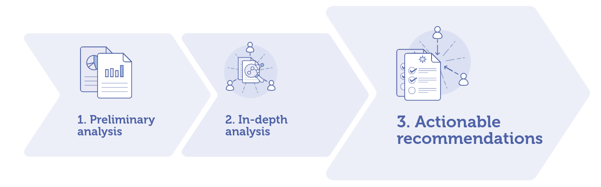
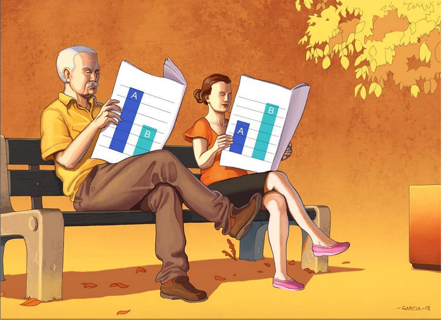
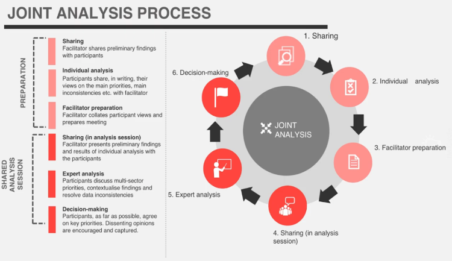
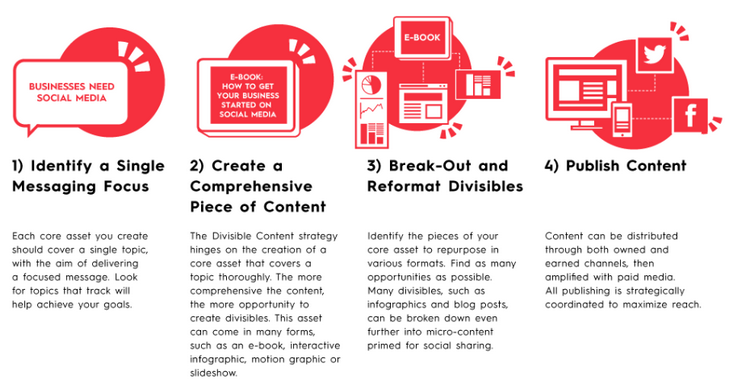

```{r setup, include=FALSE}
options(htmltools.dir.version = FALSE)
knitr::opts_chunk$set(
  warning = FALSE,
  message = FALSE,
  fig.showtext = TRUE
)
library(tidyverse)
library(unhcrthemes)
library(fontawesome)
```




???


---

## Agree to disagree




---

## Joint Data Interpretation




???


--- 

## Building Publication-Tailored Content 

Having refugee and displacement topics in major news channel is key to retain public attention and consequently fundraising. Though in the recent years, the topic of refugees and displacement has tended to enter the list of overly saturated topics. Journalists, publications, and the public want to know the core message as quickly as possible and press release on institutional website do not get maximum audience. Instead of pitching content to publishers post-completion, bringing publishers into content development and ensuring that it will be appealing to their audience from the start has a lot of advantages: Ideas are vetted by the publishing partner (they may have ideas to share as well), content is designed for the publication’s aesthetic and/or preferences, the publisher provides feedback on content iterations, content is typically co-branded.

In order to bring the potential publishers in the content creation, it requires to pro-actively identify and reach out to them. It might also be necessary to offer some exclusivity as publishers want content their competitors don’t have. As a result, Publication-Tailored content approach greatly increases the likelihood of getting published and reaching out to a larger audience, leveraging the time and energy investment and resulting in more traffic to UNHCR regular communication channel. Continued collaboration with publishers can also change the partnership approach as the same entity can then proactively start asking for high-quality and free content to help support their stories.

---

## Get more for less effort: Divisible Content Strategy

.pull-left[
 
 .bg-blue[
Nowadays, the average consumer attention span is less than 10 sec. Long reports are therefore less likely to draw large audience.
] 

“Divisible Content Strategy” consists in breaking  a traditional report into a few articles, an infographic, social microcontent, or even a motion graphic video. For instance, if an article includes 5 different charts, each chart can be posted it as a visual tweet implying that the same content can be promoted through different angles.

]

.pull-right[



]


---


## Publication Tips


.pull-left[
 1. Each chapter from the report should behave as an independent article. Reports to be shared through usual publication approach on http://data.unhcr.org . Potentially an EPUB version (for people using e-readers) of the report, in addition of the PDF version can be offered.

 2. The full report can be shared within existing platform and sub-articles can be shared in parallel within blogging platform like Medium4 or pre-identified publication partner.

 3. Article Headline shall be eye-catching to pique the interest of the audience: Use verbs, keep length under between60–100 characters5.

 4. The ideal length of an article should be between 1500 and 2500 characters, taking an average 7 minutes to read6.

 5. Charts should be self-explanatory in order to be engaging. This implies to have both a title (with same constraint that a headline, less than 80 char) and sub-title that should act as a short interpretation hint. Chart items should be concise (less than 40 characters). There should be a chart caption stating the reference and date of the data collection as well as the number of observations and confidence interval. A good chart shall deliver a clear message in less than 10 seconds, it is therefore key to adopt a minimalist design.

 6. Content shall include integrated social media sharing tools (like “Click to Tweet”) in order to make it easy for readers to share interesting information within the content. Shareable content shall include systematically one graphic from the article as it acts as a powerful micro-content, i.e. teaser for the main story.
]

.pull-right[


 7. Content shall systematically include a call to action at the end of each article, direct the audience to take the next action: link to donate, link to the full report, link to the most recent appeal or link to subscribe to mailing list.

 8. Publication timing should be planned: according to research, the optimal times to publish posts are Monday and Thursday at 9:30 a.m. EST, with most blogs being read at around 11 a.m.

 8. Core piece of content shall be tweeted and shared in other social medias 3-4 times the first day using the main angle. The rest of microcontents can be tweeted in the rest of the first week.

 9.  Notify subscribers once by email, a day after the piece has gone live. This gives some lead time to get the social share numbers up, which increases the chances that others will share.

 10. An editorial calendar and media plan should be established in advance so a human story and a Briefing Note can accompany the release of each report
]


---

## Impact measurement of you campaign

The following metrics can be potentially measured at Bureau level on the microsite to assess the success of the dissemination strategy.

---
class: inverse, center, middle

# Thank you
